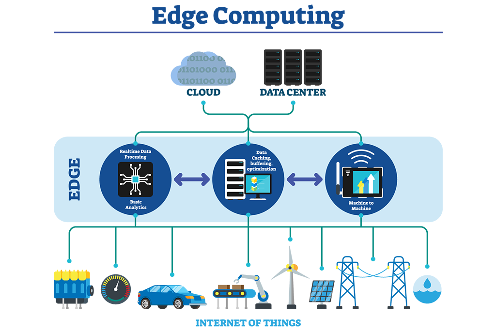
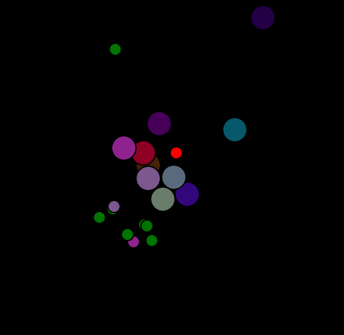
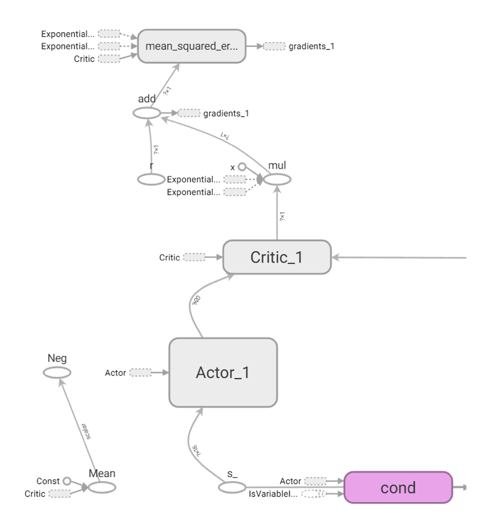
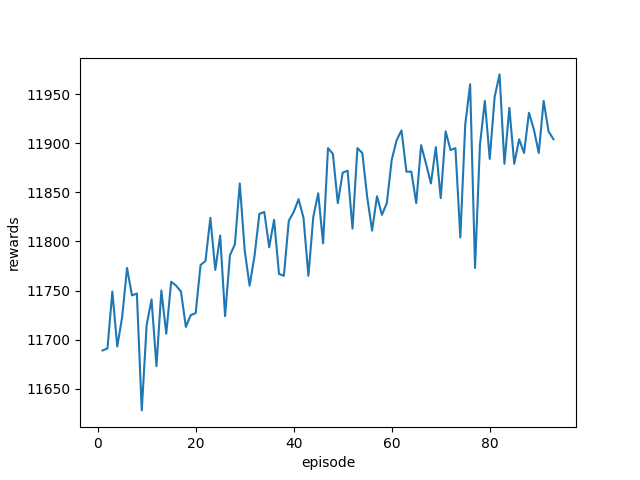
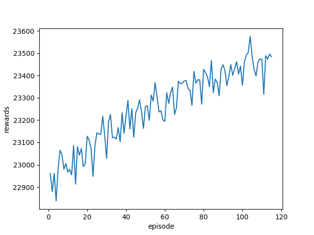
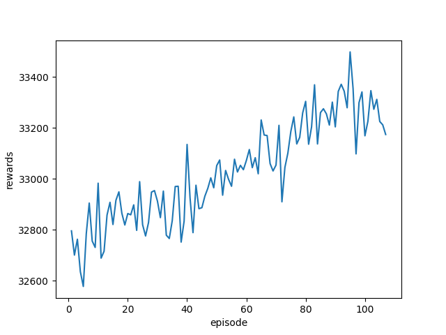
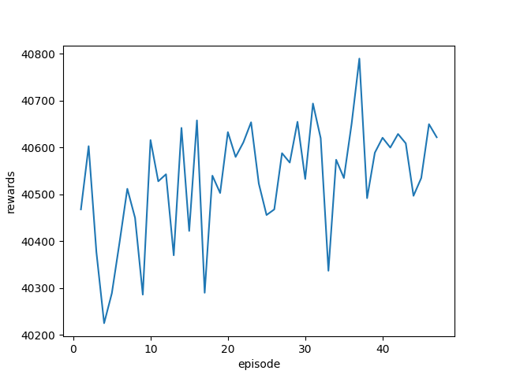

# ***Resources Allocation in The Edge Computing Environment Using Reinforcement Learning***

## Summary
The cloud computing based mobile applications, such as augmented reality (AR), face recognition, and object recognition have become popular in recent years. However, cloud computing may cause high latency and increase the backhaul bandwidth consumption because of the remote execution. To address these problems, edge computing can improve response times and relieve the backhaul pressure by moving the storage and computing resources closer to mobile users.

Considering the computational resources, migration bandwidth, and offloading target in an edge computing environment, the project aims to use Deep Deterministic Policy Gradient (DDPG), a kind of Reinforcement Learning (RL) approach, to allocate resources for mobile users in an edge computing environment.

 
 picture originated from: [IEEE Inovation at Work](https://innovationatwork.ieee.org/real-life-edge-computing-use-cases/)
***

## Prerequisite

+ Python 3.7.5
+ Tensorflow 2.2.0
+ Tkinter 8.6

***

## Build Setup

### *Run The System*

```cmd
$ python3 src/run_this.py
```

### *Text Interface Eable / Diable* (in run_this.py)

```python
TEXT_RENDER = True / False
```

### *Graphic Interface Eable / Diable* (in run_this.py)

```python
SCREEN_RENDER = True / False
```

***

## Key Point

## *Edge Computing Environment*

+ Mobile User
  + Users move according to the mobility data provided by [CRAWDAD](https://crawdad.org/index.html). This data was collected from the users of mobile devices at the subway station in Seoul, Korea.
  + Users' devices offload tasks to one edge server to obtain computation service.
  + After a request task has been processed, users need to receive the processed task from the edge server and offload a new task to an edge server again.

+ Edge Server
  + Responsible for offering computational resources *(6.3 * 1e7 byte/sec)* and processing tasks for mobile users.
  + Each edge server can only provide service to limited numbers of users and allocate computational resources to them.
  + The task may be migrated from one edge server to another within limited bandwidth *(1e9 byte/sec)*.

+ Request Task: [VOC SSD300 Objection Detection](https://link.springer.com/chapter/10.1007/978-3-319-46448-0_2)
  + state 1 : start to offload a task to the edge server
  + state 2 : request task is on the way to the edge server *(2.7 * 1e4 byte)*
  + state 3 : request task is proccessed *(1.08 * 1e6 byte)*
  + state 4 : request task is on the way back to the mobile user *(96 byte)*
  + state 5 : disconnect (default)
  + state 6 : request task is migrated to another edge server

+ Graphic Interface

  
  + Edge servers *(static)*
    + Big dots with consistent color
  + Mobile users *(dynamic)*
    + Small dots with changing color
    + Color
      + Red : request task is in state 5
      + Green : request task is in state 6
      + others : request task is handled by the edge server with the same color and is in state 1 ~ state 4

## *Deep Deterministic Policy Gradient* (in DDPG.py)

+ Description
  
  While determining the offloading server of each user is a discrete variable problem, allocating computing resources and migration bandwidth are continuous variable problems. Thus, Deep Deterministic Policy Gradient (DDPG), a model-free off-policy actor-critic algorithm, can solve both discrete and continuous problems. Also, DDPG updates model weights every step, which means the model can adapt to a dynamic environment instantly.

+ State

  ```python
    def generate_state(two_table, U, E, x_min, y_min):
        one_table = two_to_one(two_table)
        S = np.zeros((len(E) + one_table.size + len(U) + len(U)*2))
        count = 0
        for edge in E:
            S[count] = edge.capability/(r_bound*10)
            count += 1
        for i in range(len(one_table)):
            S[count] = one_table[i]/(b_bound*10)
            count += 1
        for user in U:
            S[count] = user.req.edge_id/100
            count += 1
        for user in U:
            S[count] = (user.loc[0][0] + abs(x_min))/1e5
            S[count+1] = (user.loc[0][1] + abs(y_min))/1e5
            count += 2
        return S
  ```

  + **Available computing resources** of each edge server
  + **Available migration bandwidth** of each connection between edge servers
  + **Offloading target** of each mobile user
  + **Location** of each mobile user

+ Action

  ```python
  def generate_action(R, B, O):
    a = np.zeros(USER_NUM + USER_NUM + EDGE_NUM * USER_NUM)
    a[:USER_NUM] = R / r_bound
    # bandwidth
    a[USER_NUM:USER_NUM + USER_NUM] = B / b_bound
    # offload
    base = USER_NUM + USER_NUM
    for user_id in range(USER_NUM):
        a[base + int(O[user_id])] = 1
        base += EDGE_NUM
    return a
  ```

  + **Computing resources**  of each mobile user's task need to uses(continuous)
  + **Migration bandwidth** of each mobile user's task needs to occupy (continuous)
  + **Offloading target** of each mobile user (discrete)

+ Reward
  + **Total processed tasks** in each step

+ Model Architecture

  

***

## Simulation Result

+ Simulation Environment
  + 10 edge servers with computational resources *6.3 * 1e7 byte/sec*
  + Each edge server can provide at most 4 task processing services.
  + 3000 steps/episode, 90000 sec/episode

+ Result
    | Number of Clients | Average Total proccessed tasks in the last 10 episodes| Training History |
    | :-------: | :--------: | :--------: |
    | 10 | 11910 |  |
    | 20 | 23449 |  |
    | 30 | 33257 |  |
    | 40 | 40584 |  |

***

## Demo

+ Demo Environment

  + 35 mobile users and 10 edge servers in the environment
  + Each edge server can provide at most 4 task processing services.

+ Demo Video

  

***

## Reference

+ Mobility Data
  
  [Mongnam Han, Youngseok Lee, Sue B. Moon, Keon Jang, Dooyoung Lee, CRAWDAD dataset kaist/wibro (v. 2008‑06‑04), downloaded from https://crawdad.org/kaist/wibro/20080604, https://doi.org/10.15783/C72S3B, Jun 2008.](https://crawdad.org/kaist/wibro/20080604)
